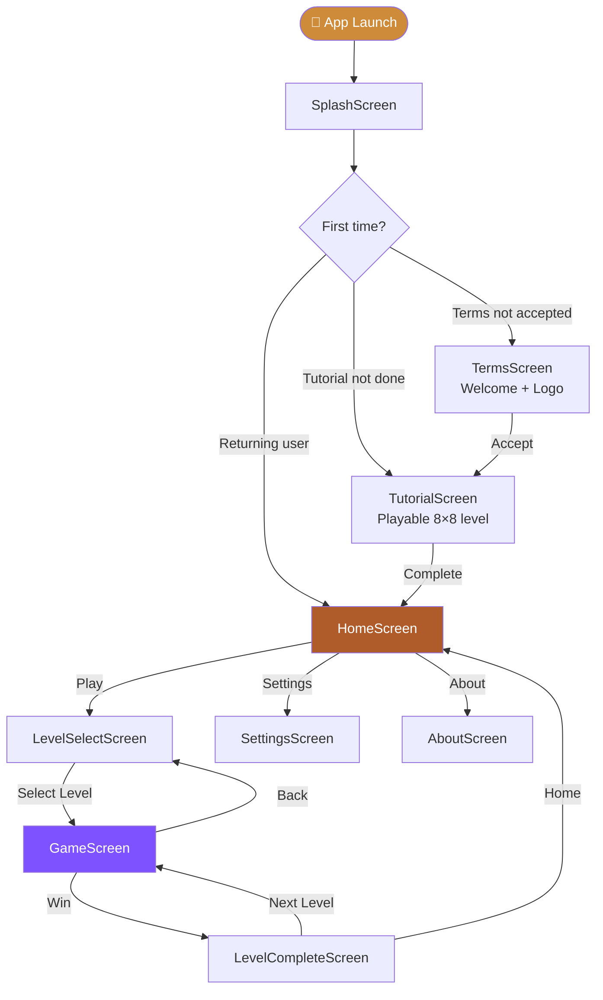
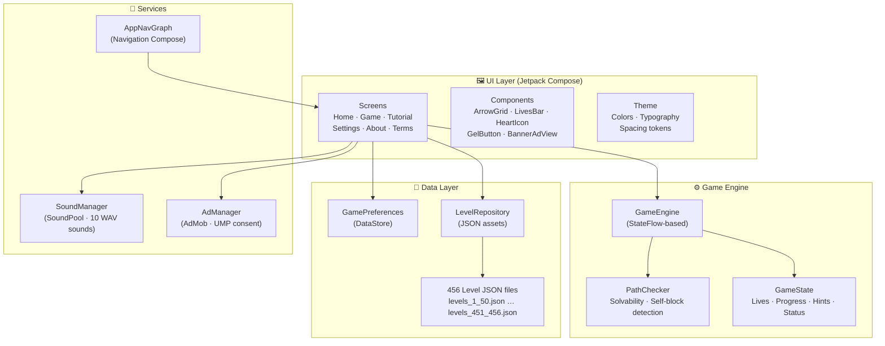
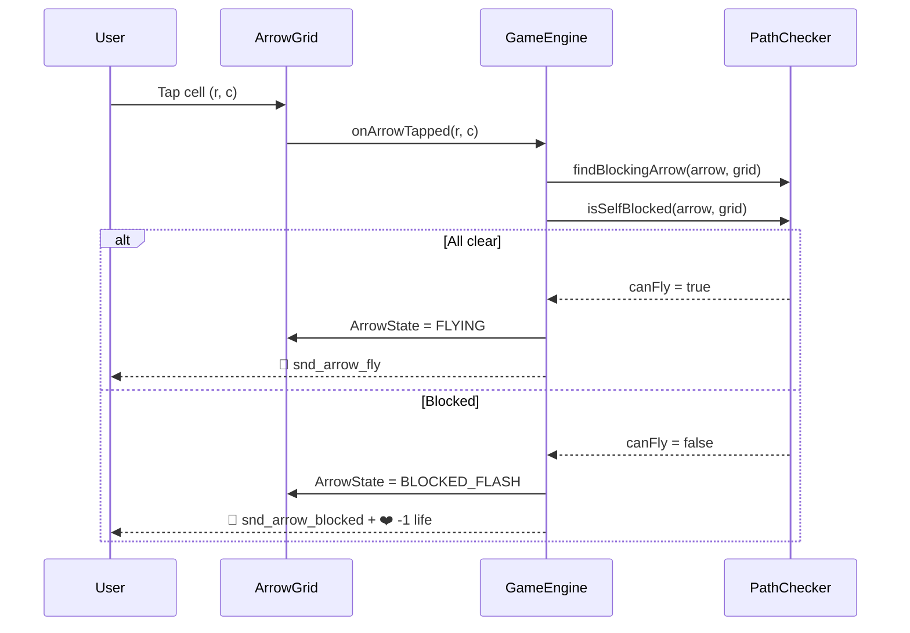
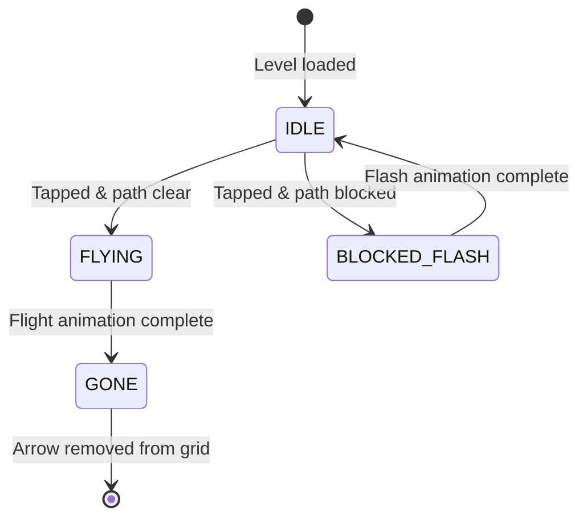
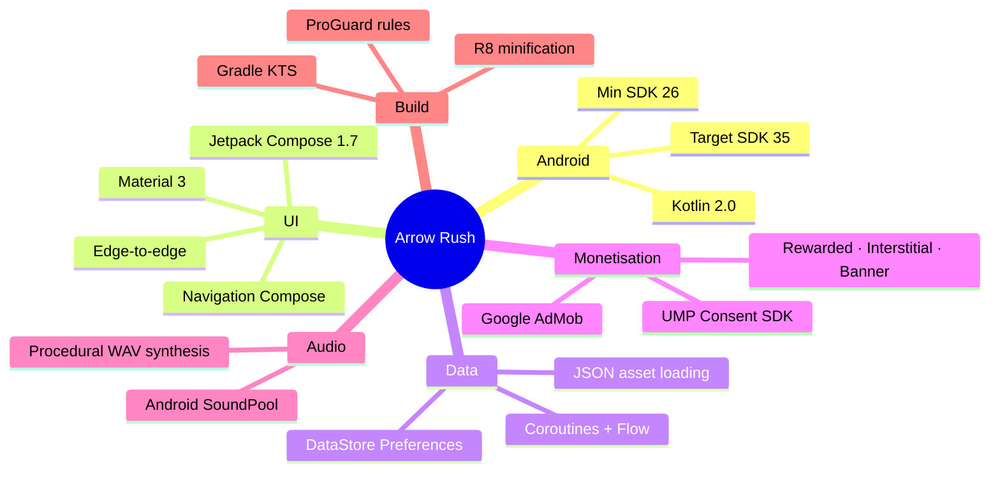

<div align="center">


# ⬆️ Arrow Rush

### *A minimalist logic puzzle game — 456 handcrafted levels, zero filler.*

[](https://android.com)
[](https://kotlinlang.org)
[](https://developer.android.com/compose)
[](legal/terms.html)
[](https://github.com/Mohit-Gidwani)

</div>

---

## 🎯 What is Arrow Rush?

Arrow Rush is a **snake-path logic puzzle** for Android. Each level presents a grid of interlocked arrows — every arrow is a "snake" that can only fly off the board if its escape lane is clear. Your job: figure out the right **order** to tap them.

It's deceptively simple, endlessly satisfying.

---

## ✨ Feature Highlights

| Feature | Details |
|---|---|
| 🧩 **456 Levels** | Handcrafted puzzles spanning Easy → Expert |
| 🐍 **Snake-path arrows** | Each arrow is a multi-cell path, not just a single tile |
| 🔒 **Solvability guaranteed** | All levels mathematically verified via `fix_levels.py` |
| 🎓 **Playable tutorial** | First-time players complete a real mini-level before starting |
| 💡 **Hint system** | Earn hints by watching rewarded ads |
| 🔊 **10 synthesised sounds** | Custom-generated WAV audio, zero external assets |
| 📱 **Edge-to-edge UI** | Full Jetpack Compose, Material 3, animated transitions |
| 🚫 **No accounts** | Zero sign-in, all progress stored locally via DataStore |
| 🛡️ **GDPR/CCPA compliant** | UMP consent before any personalised ads |

---

## 📸 Screenshots

<div align="center">

| Home Screen | Tutorial | Gameplay | Level Complete |
|:-----------:|:--------:|:--------:|:--------------:|
| *(coming soon)* | *(coming soon)* | *(coming soon)* | *(coming soon)* |

</div>

---

## 🗺️ App Navigation Flow



---

## 🏗️ Architecture



---

## 🧠 Game Engine Deep Dive

### How the PathChecker works



### Arrow states lifecycle



---

## 📊 Level Statistics

| Difficulty | Range | Count | Grid Sizes | Avg. Arrows |
|:---:|:---:|:---:|:---:|:---:|
| 🟢 **Easy** | 1–100 | 100 | 6×6 – 8×8 | 4–6 |
| 🟡 **Medium** | 101–250 | 150 | 8×8 – 10×10 | 6–9 |
| 🟠 **Hard** | 251–400 | 150 | 10×10 – 12×12 | 8–12 |
| 🔴 **Expert** | 401–456 | 56 | 12×12 – 14×14 | 10–15 |
| **Total** | **1–456** | **456** | — | — |

> All 456 levels are **mathematically verified** to be solvable — see [`fix_levels.py`](fix_levels.py).

```
Level distribution:
Easy   ████████████████████░░░░░░░░░░  100
Medium ██████████████████████████████  150
Hard   ██████████████████████████████  150
Expert █████████████░░░░░░░░░░░░░░░░░   56
```

---

## 🔊 Sound System

All sounds are **procedurally synthesised** using Python's stdlib (`wave`, `math`) — no external sound packs, no licensing hassle.

| Sound File | Trigger | Duration | Design |
|---|---|---|:---:|
| `snd_arrow_tap.wav` | Every arrow tap | 50ms | High-freq click decay |
| `snd_arrow_fly.wav` | Arrow flies off | 220ms | Rising chirp + breath noise |
| `snd_arrow_blocked.wav` | Path blocked | 180ms | Low thud + body resonance |
| `snd_life_lost.wav` | Life deducted | 280ms | Exponential pitch drop |
| `snd_level_complete.wav` | Level won | 800ms | C4–E4–G4–C5 arpeggio |
| `snd_game_over.wav` | All lives gone | 900ms | G4–F4–C4 descending |
| `snd_button_click.wav` | UI button press | 60ms | Soft sine decay |
| `snd_hint.wav` | Hint revealed | 450ms | Bell overtone series |
| `snd_tutorial_done.wav` | Tutorial cleared | 700ms | E5–G5–C6–E6 sparkle |
| `snd_level_start.wav` | Level loads | 300ms | Two-tone ready cue |

Regenerate all sounds anytime:
```bash
python generate_sounds.py
```

---

## 🛠️ Tech Stack



---

## 📁 Project Structure

```
Arrow-game/
├── app/src/main/
│   ├── assets/levels/          ← 456 level JSON files (split by 50)
│   ├── java/com/arrowrush/game/
│   │   ├── audio/
│   │   │   └── SoundManager.kt          ← SoundPool singleton
│   │   ├── ads/
│   │   │   ├── AdManager.kt             ← AdMob + UMP
│   │   │   └── BannerAdView.kt
│   │   ├── data/
│   │   │   ├── GamePreferences.kt       ← DataStore keys & ops
│   │   │   ├── Level.kt                 ← Level + ItemDef models
│   │   │   └── LevelRepository.kt       ← JSON → Level parsing
│   │   ├── engine/
│   │   │   ├── GameEngine.kt            ← StateFlow game logic
│   │   │   └── PathChecker.kt           ← Solvability & blocking
│   │   └── ui/
│   │       ├── components/
│   │       │   ├── ArrowGrid.kt         ← Main game canvas
│   │       │   ├── LivesBar.kt          ← Canvas heart icons
│   │       │   └── GelIconButton.kt
│   │       ├── navigation/
│   │       │   └── AppNavGraph.kt       ← All routes
│   │       ├── screens/
│   │       │   ├── SplashScreen.kt
│   │       │   ├── TermsScreen.kt       ← First-run onboarding
│   │       │   ├── TutorialScreen.kt    ← Playable tutorial level
│   │       │   ├── HomeScreen.kt
│   │       │   ├── LevelSelectScreen.kt
│   │       │   ├── GameScreen.kt        ← Core gameplay
│   │       │   ├── LevelCompleteScreen.kt
│   │       │   ├── SettingsScreen.kt
│   │       │   └── AboutScreen.kt
│   │       └── theme/
│   │           └── Color.kt             ← Design tokens
│   └── res/raw/                         ← 10 WAV sound files
├── legal/
│   ├── terms.html                       ← Terms of Service
│   └── privacy.html                     ← Privacy Policy
├── fix_levels.py                        ← Level solvability verifier
├── generate_sounds.py                   ← Procedural audio generator
└── sort_levels.py                       ← Level sort utility
```

---

## 🚀 Getting Started

### Prerequisites

- Android Studio Hedgehog or later
- JDK 17+
- Android SDK 35

### Regenerate Sound Effects

```bash
python generate_sounds.py
# Outputs 10 WAV files to app/src/main/res/raw/
```

### Verify Level Solvability

```bash
python fix_levels.py
# Checks all 456 levels and fixes any self-blocked arrows
```

---

## 🔐 Privacy & Legal

Arrow Rush is **privacy-first by design**:

- ✅ **No user accounts** — zero sign-in required
- ✅ **No server-side data** — all progress stored locally via Android DataStore
- ✅ **GDPR/CCPA compliant** — UMP consent dialog before personalised ads
- ✅ **No analytics SDKs** — no Firebase, no Crashlytics, no tracking
- ⚠️ **Google AdMob** — may collect device-level data for ad serving

| Document | Link |
|---|---|
| Terms of Service | [legal/terms.html](legal/terms.html) |
| Privacy Policy | [legal/privacy.html](legal/privacy.html) |
| Contact | ArrowsRush.support@gmail.com |

---

## 📬 Contact & Support

**Elevate Apps Inc**
📧 [ArrowsRush.support@gmail.com](mailto:ArrowsRush.support@gmail.com)
📸 [@arrowrushapp](https://instagram.com/arrowrushapp)

---

<div align="center">

**Made with ❤️ by [Elevate Apps Inc](https://github.com/Mohit-Gidwani)**

*Star ⭐ the repo if you like the project!*

</div>
